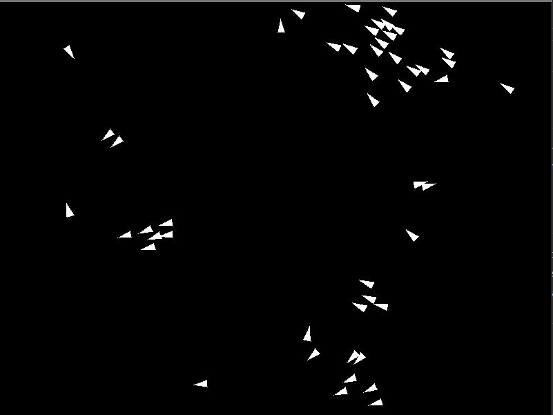

# Boids Simulator

This is a simple Boids simulation implemented using Python and Pygame. Boids are simulated flocking agents that mimic the behavior of birds, fish, or other swarming animals. The simulation demonstrates basic flocking behavior through three main steering behaviors: separation, alignment, and cohesion.

## Features

- **Separation**: Boids steer to avoid crowding their neighbors.
- **Alignment**: Boids steer towards the average heading of their neighbors.
- **Cohesion**: Boids steer to move towards the average position of their neighbors.

